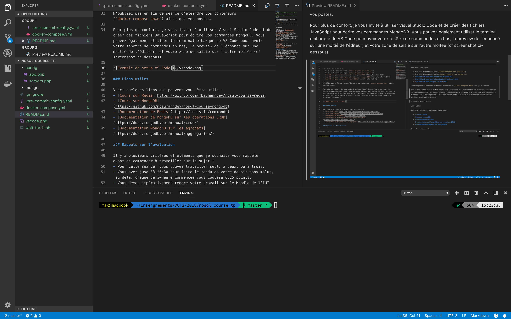

TP 2
====

Ce dépôt est prévu pour une séance de rattrapage. L'énnoncé est envoyé par mail uniquement, le dépôt contient uniquement l'environement technique requis.

Environement technique
----------------------

Pour cette séance, je vous fourni de nouveau un environement technique basé sur docker.

Pour démarrer votre environement, vous pouvez faire la commande suivante :

```
docker-compose up -d
```

Vous aurez alors accès à :
- Une ligne de commande redis (`docker-compose run redis-cli`)
- Une ligne de commande mongo (`docker-compose run mongo-cli`)
- [Une IHM web pour redis (readis) sur le port 8080](http://localhost:8080)
- [Une IHM web pour redis (phpredisadmin) sur le port 8081](http://localhost:8081)
- [Une IHM web pour mongo sur le port 8082](http://localhost:8082)

N'oubliez pas en fin de séance d'éteindre vos conteneurs (`docker-compose down`) ainsi que vos postes.

Pour plus de confort, je vous invite à utiliser Visual Studio Code et de créer des fichiers JavaScript pour écrire vos commandes MongoDB. Vous pouvez également utiliser le terminal embarqué de VS Code pour avoir votre fenêtre de commandes en bas (Menu "View" > "Terminal"), la preview de l'énnoncé sur une moitié de l'éditeur (icône avec deux colones et une loupe en haut à droite de votre fenêtre VS Code), et votre zone de saisie sur l'autre moitée (cf screenshot ci-dessous).



Liens utiles
------------

Voici quelques liens qui peuvent vous être utile :
- [Cours sur Redis](https://github.com/mbaumanndev/nosql-course-redis)
- [Cours sur MongoDB](https://github.com/mbaumanndev/nosql-course-mongodb)
- [Documentation de Redis](https://redis.io/commands)
- [Documentation de RediSearch](https://oss.redislabs.com/redisearch/)
- [Documentation de MongoDB sur les opérations CRUD](https://docs.mongodb.com/manual/crud/)
- [Documentation MongoDB sur les agrégats](https://docs.mongodb.com/manual/aggregation/)
